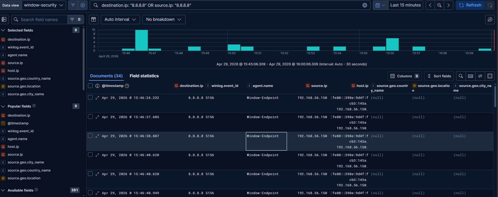
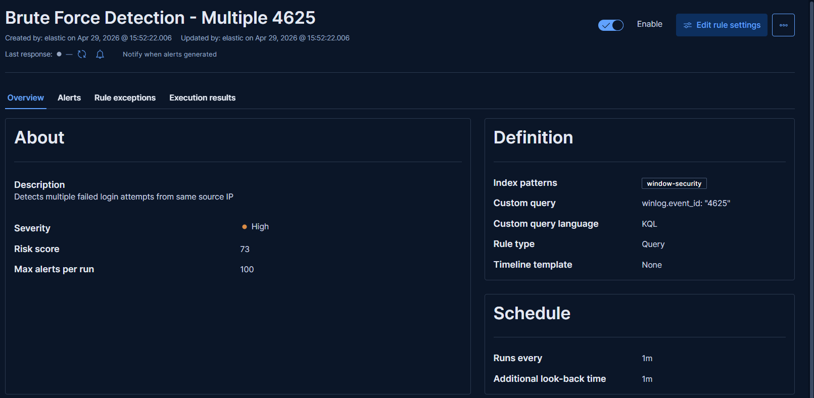
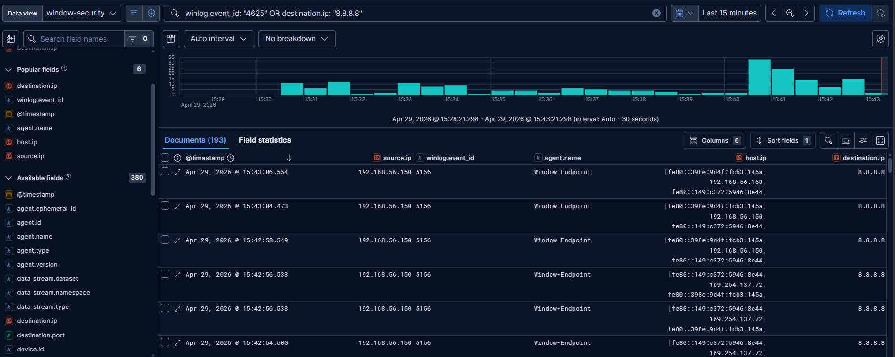

# Advanced Log Analysis

**Environment:** Elastic Stack (Kibana @ 192.168.56.101:5601)  
**Data Source:** Windows Endpoint via Fleet Agent  
**Date:** 29 April 2026

---

## 1. Log Correlation

Correlated Windows Security events to identify suspicious patterns.

**Query Used:**

winlog.event_id: "4625" OR destination.ip: "8.8.8.8"

**Correlation Table:**

| @timestamp | Event ID | Source IP | Destination IP | Notes |
|------------|----------|-----------|----------------|-------|
| Apr 29 @ 15:42:54 | 4625 | 192.168.56.150 | - | Failed login attempt |
| Apr 29 @ 15:42:56 | 4625 | 192.168.56.150 | - | Failed login retry |
| Apr 29 @ 15:42:58 | 4625 | 192.168.56.150 | - | Multiple failures |
| Apr 29 @ 15:46:24 | 5156 | 192.168.56.150 | 8.8.8.8 | Outbound connection |
| Apr 29 @ 15:46:37 | 5156 | 192.168.56.150 | 8.8.8.8 | Repeated outbound |
| Apr 29 @ 15:46:41 | 5156 | 192.168.56.150 | 8.8.8.8 | Suspicious pattern |

**Findings:** Same source IP triggered multiple 4625 (failed logins), immediately followed by outbound 5156 connections to 8.8.8.8 — potential brute-force followed by C2 communication.

---

## 2. Anomaly Detection Rule

Created custom detection rule in Kibana Security.

**Rule Details:**
- **Name:** Brute Force Detection - Multiple 4625
- **Query:** `winlog.event_id: "4625"`
- **Severity:** High (Risk Score: 73)
- **Schedule:** Every 1 minute
- **Index Pattern:** windows-security

**Purpose:** Automatically detect repeated failed login attempts from same source IP within a 1-minute window.

---

## 3. Log Enrichment (GeoIP)

Verified GeoIP enrichment is available in Elastic Stack.

**Geo Fields Available:**
- `source.geo.country_name`
- `source.geo.city_name`
- `source.geo.location`

**Note:** GeoIP data populates for public IPs (e.g., 8.8.8.8). Private IPs (192.168.x.x, fe80::) show null — expected behavior. This enrichment provides instant geographic context during investigations.

---

> **Tools Used:** Elastic Stack 8.x (Kibana), Fleet Agent, Windows Security Events  
> **VM:** 192.168.56.101 (Elasticsearch + Kibana)  
> **Total Events Analyzed:** 5,255 documents  
> **Skills Applied:** Log correlation, anomaly detection rule creation, GeoIP enrichment