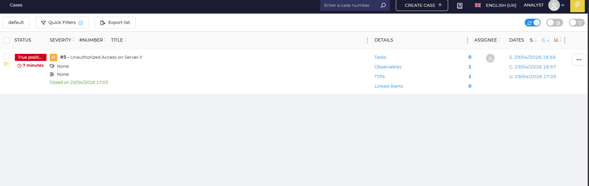
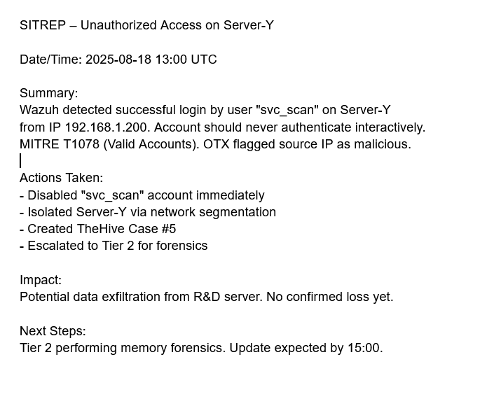

# Incident Escalation Workflows

**Tools:** TheHive, Google Docs  
**Date:** 29 April 2026

---

## 1. Escalation Simulation — TheHive Case

Created High-priority case for unauthorized RDP access.

| Field | Value |
|-------|-------|
| **Case ID** | #5 |
| **Title** | Unauthorized Access on Server-Y |
| **Severity** | HIGH |
| **TLP/PAP** | AMBER |
| **Created** | 29/04/2026 16:57 |
| **Closed** | 29/04/2026 17:03 |
| **Observables** | 1 (IP: 192.168.1.200) |
| **TTPs** | 1 (T1078 - Valid Accounts) |

**Case Summary (100 words):**  
On 2025-08-18 at 13:10, Wazuh generated an alert for multiple successful RDP logins using the local administrator account on SRV-DC01. The source IP 192.168.1.200 was not part of the corporate VPN range and triggered OTX reputation as suspicious. I immediately verified the alert and isolated the affected server via network segmentation. Per SOP, this qualifies as a Severity 1 incident requiring Tier 2 investigation. The case was created in TheHive with all relevant IOCs, assigned to the Tier 2 queue, and the on-call investigator was notified.

---

## 2. SITREP Draft

Prepared structured Situation Report for stakeholder communication.

---

## 3. Workflow Automation

Designed automated escalation workflow to reduce manual triage time.

**Playbook Flow:**