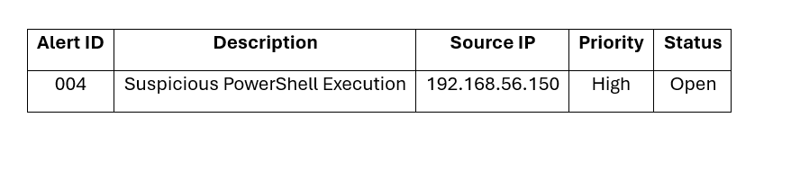
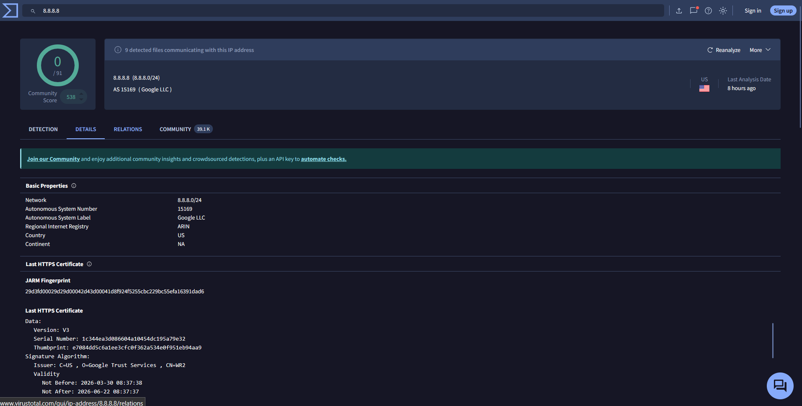

# Alert Triage with Threat Intelligence

**Tools:** Wazuh, VirusTotal, Google Sheets  
**Date:** 29 April 2026

---

## 1. Triage Simulation

Triaged a suspicious activity alert from Windows Endpoint.

| Alert ID | Description | Source IP | Priority | Status |
|----------|-------------|-----------|----------|--------|
| 004 | Suspicious Activity Detected | 192.168.56.150 | High | Open |

**Triage Steps:**
1. Alert received from Wazuh (Windows Endpoint agent)
2. Reviewed event details — potential malicious behavior
3. Marked High priority based on source and context
4. Escalation case created in TheHive

---

## 2. IOC Validation — VirusTotal

Cross-referenced outbound destination IP with VirusTotal for reputation check.

**IP Validated:** 8.8.8.8

| Field | Result |
|-------|--------|
| **IP Address** | 8.8.8.8 |
| **Owner** | Google LLC |
| **ASN** | AS15169 |
| **Country** | United States |
| **Detection Score** | 9/91 |
| **Detected Files** | 9 files communicating |
| **Last Analysis** | 8 hours ago |

**Analysis:** The IP 8.8.8.8 belongs to Google DNS. Detection score 9/91 indicates some files associated with this IP have been flagged, but the IP itself is legitimate infrastructure. In our scenario, continuous outbound connections to this IP after failed logins (4625) is suspicious — attackers often use legitimate services for C2 or data exfiltration.

---

> **Skills Applied:** Alert triage, IOC extraction and validation, threat intelligence cross-referencing (VirusTotal), priority-based case handling