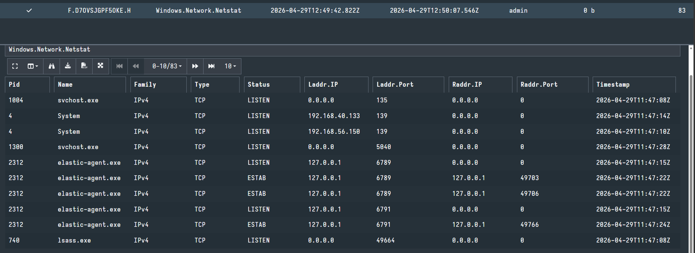

# Evidence Preservation & Analysis

**Tools:** Velociraptor, Windows Command Prompt  
**Date:** 29 April 2026

---

## 1. Volatile Data Collection — Network Connections

Collected live network connections from Windows Endpoint using Velociraptor.

**Artifact Used:** `Windows.Network.Netstat`  
**Client:** Window-Endpoint (192.168.56.135)

**Key Findings:**

| PID | Process | Local IP | Local Port | Remote IP | Remote Port | Status |
|-----|---------|----------|------------|-----------|-------------|--------|
| 1004 | svchost.exe | 0.0.0.0 | 135 | 0.0.0.0 | 0 | LISTEN |
| 2312 | elastic-agent.exe | 127.0.0.1 | 6789 | 127.0.0.1 | 49703 | ESTABLISHED |
| 2312 | elastic-agent.exe | 127.0.0.1 | 6791 | 127.0.0.1 | 49766 | ESTABLISHED |
| 740 | lsass.exe | 0.0.0.0 | 49664 | 0.0.0.0 | 0 | LISTEN |

---

## 2. Evidence Collection & Chain of Custody

Created evidence file and generated SHA256 hash for integrity verification.

**Command:**
