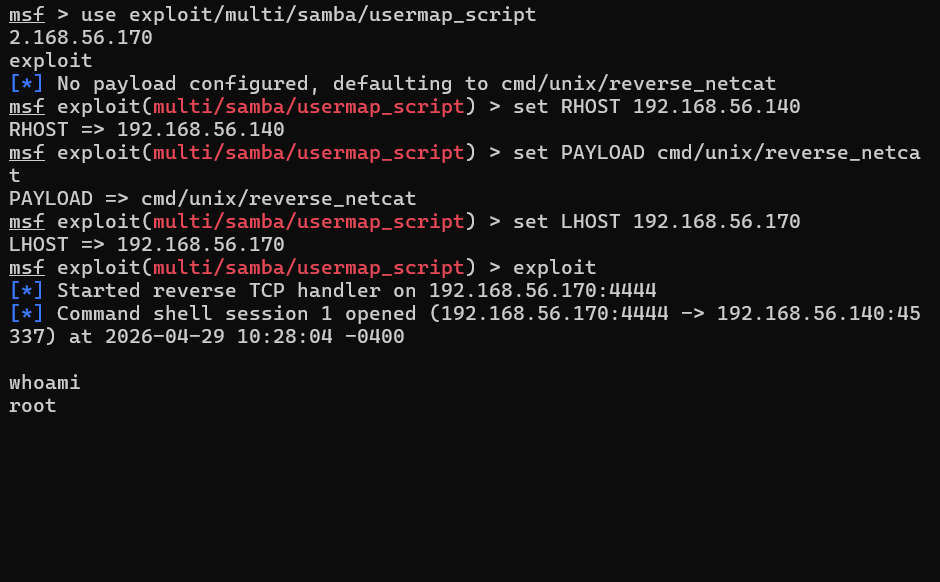
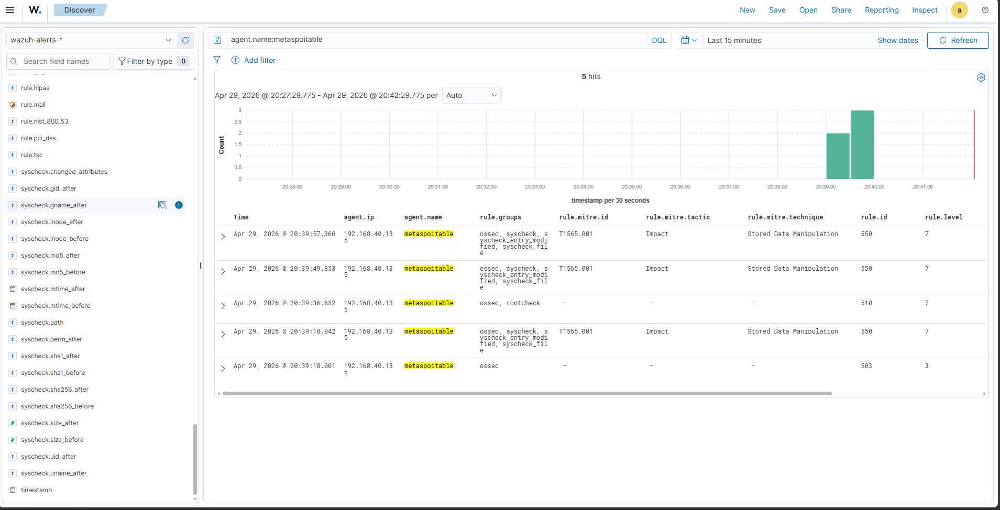
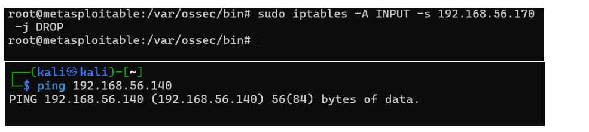
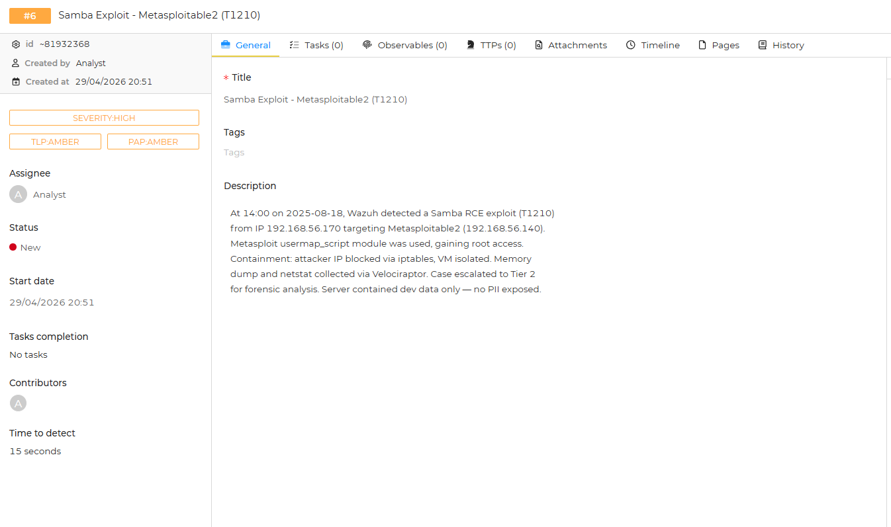
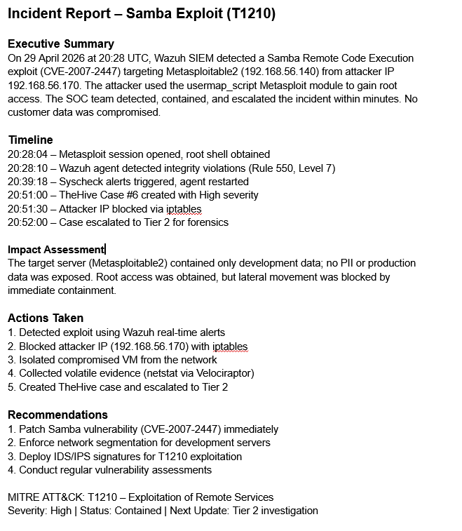
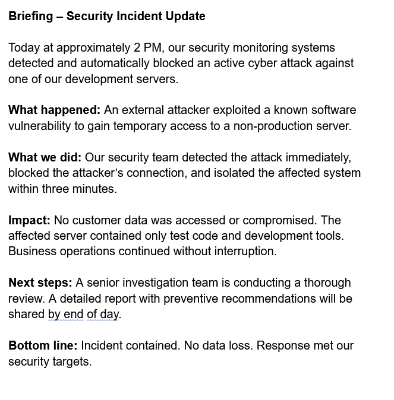

# Capstone Project: Full SOC Workflow Simulation

**Date:** 29 April 2026  
**Objective:** Simulate an end-to-end attack, detection, response, escalation, and reporting.

---

## Attack Simulation
- **Tool:** Metasploit (Kali Linux)
- **Target:** Metasploitable2 (192.168.56.140)
- **Exploit:** `multi/samba/usermap_script` (CVE-2007-2447, MITRE T1210)
- **Result:** Root shell obtained.

---

## Detection (Wazuh)
- Wazuh agent detected integrity violations and rootcheck anomalies.
- Alerts: Level 7, Rule 550, 510.
- Tactic: Impact, MITRE T1565.001.

---

## Response & Containment
- Attacker IP (192.168.56.170) blocked via iptables on target.
- Verified with ping failure.
- Compromised VM isolated.

---

## Incident Escalation (TheHive)
- **Case ID:** #6
- **Severity:** HIGH
- **TLP/PAP:** AMBER
- **Summary:** Samba exploit, root access, contained within minutes. Escalated to Tier 2.

---

## Reporting
Two official documents were generated:

- **Incident Report (200 words):** Executive summary, timeline, impact, actions, recommendations.
- **Manager Briefing (100 words):** Non-technical summary for stakeholders.

PDFs available in the `reports/` folder.

---

## Evidence Collection
- Netstat connections captured via Velociraptor.
- SHA256 hash generated for chain of custody.

**Files:**
- `evidence/netstat-output.csv`
- `evidence/evidence.txt` (hash: `12e8a189c6c0182a3323bbad8bc692e75ac6bcbec4c32b0a7add9099a84c6c9c`)

---

> **Skills Demonstrated:** Attack simulation, SIEM detection, containment, case management, professional reporting, evidence integrity.